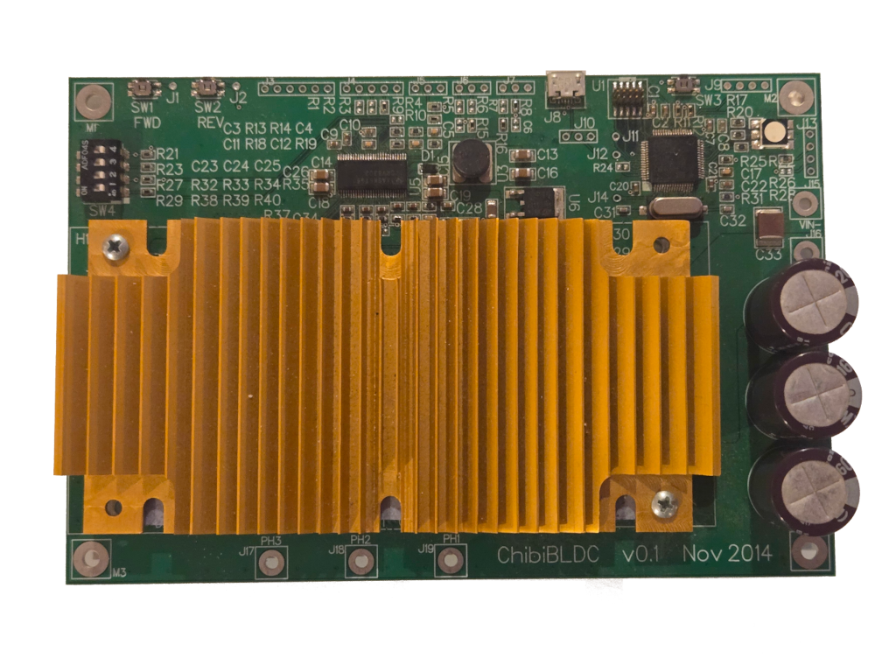
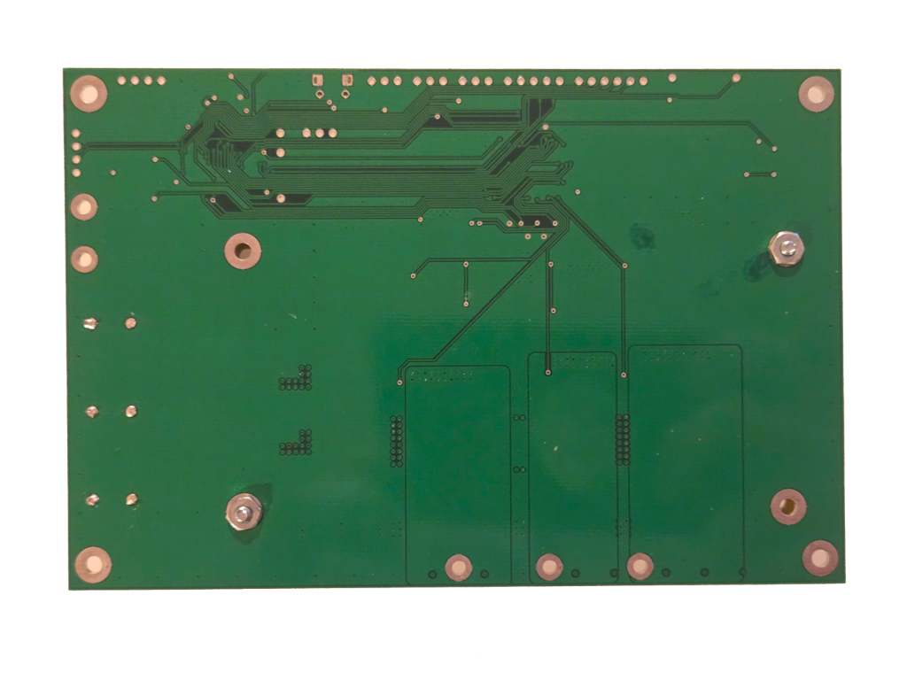

# Chibi-ECEN-BLDC - Three-Phase Brushless DC Motor Driver

*A prototype BLDC motor controller designed for learning Mentor Graphics XDX PCB design (Fall 2014)*


<p align="center">
  
  
</p>

## Overview

Chibi-ECEN-BLDC is a three-phase brushless DC motor driver PCB intended as a test platform for developing field-oriented control (FOC) software for a 480-watt brushless DC motor.

The design was inspired by Benjamin Vedder's open-source BLDC controller ([VESC](http://vedder.se/2014/01/a-custom-bldc-motor-controller/), v4, circa 2014), with customizations for this specific use case and a completely redesigned physical layout.

⚠️ **Educational Prototype** - This was a graduate student project from 2014 focused on PCB layout techniques for power electronics. While the design is complete and boards were fabricated, this should be considered a learning exercise rather than a production-ready design. Firmware development was not released as part of the project.

## Key Features

- Three-phase BLDC motor control with field-oriented control capability
- Integrated DRV8302 driver with 5V buck converter and current sensing
- Multiple interface options: USB, JTAG, I2C, RS-232
- Hall effect sensor inputs for rotor position feedback
- Configurable throttle, brake, and torque sensor inputs
- Reverse polarity and over-voltage protection
- Thermal monitoring (motor and driver temperature)
- Heatsink mounting for D2PAK power MOSFETs
- RGB status LED and configuration DIP switches

## Technical Specification

- **Input Voltage:** 48 VDC (nominal)
- **Output Current:** 10 Amps maximum (bus input average)
- **Switching Frequency:** 20 kHz
- **Microcontroller:** STM32F405RGT6 (ARM Cortex-M4, 168 MHz)
- **Driver IC:** DRV8302 three-phase bridge pre-driver with integrated buck converter
- **PCB:** 4-layer design optimized for thermal management and high-current routing

### Key Design Challenges

The primary focus of this project was layout for a high-current system and managing a large component count. Design constraints included:

- **Thermal Management** - Large copper pours for power routing, heatsink mounting clearances
- **High Voltage Isolation** - 0.006" trace separation for 50 VDC systems (per IPC standards)
- **Power Handling** - Appropriate trace widths for 10A current capacity
- **EMI Mitigation** - Separation of digital, analog, and power domains

Layout techniques explored include push-and-plow routing, teardrop vias, and conductive copper shapes for optimizing power pad connections.

## Design Tools

- **PCB Design:** Mentor Graphics Xpedition XDX (EEVX.1, 2014)
- **Schematic:** Xpedition
- **MCU Configuration:** STM32CubeMX
- **Simulation:** LTspice

## Repository Contents

```
├── README.md                    # This file
├── LICENSE                      # MIT License
├── hardware/
│   ├── schematic.pdf           # 5-sheet schematic
│   ├── bom.csv                 # Bill of materials (CSV format)
│   └── bom.ods                 # Bill of materials (OpenDocument)
├── gerbers/                    # Manufacturing files (Gerber + drill)
│   ├── Gerber/                 # Gerber plot files
│   └── NCDrill/                # NC drill files
├── design-source/
│   ├── xdx/                    # Mentor Graphics Xpedition source files
│   ├── cubemx/                 # STM32CubeMX configuration
│   └── simulation/             # LTspice simulation files
├── docs/
│   ├── hardware-specification.md   # Detailed system specifications
│   ├── pinouts.md                  # STM32 pin assignments
│   └── connectors.md               # Connector pinout reference
├── datasheets/                 # Key component datasheets
└── media/                      # Board photographs
    ├── chibi-ecen-bldc-front-transparent.png
    └── chibi-ecen-bldc-back-transparent.png
```

## Getting Started

### Manufacturing (not recommended)

Gerber files and drill files are available in `gerbers/`. The PCB is a 4-layer design:
- Layer 1: Top copper (signal + power)
- Layer 2: Inner ground plane
- Layer 3: Inner power plane
- Layer 4: Bottom copper (signal + power)

## Documentation

- [Hardware Specification](docs/hardware-specification.md) - Detailed system design
- [Pin Assignments](docs/pinouts.md) - STM32 pinout reference
- [Connector Pinouts](docs/connectors.md) - External connector reference

### Bill of Materials

The complete BOM is available in `hardware/bom.csv` and `hardware/bom.ods`. Key components:
- STM32F405RGT6 microcontroller
- DRV8302 motor driver IC
- Power MOSFETs and Schottky diodes (D2PAK)
- Supporting passives and connectors


Note: The Xpedition source files are in a legacy format. The PDF schematic in `hardware/` is recommended for viewing.

## License

This project is released under the MIT License - see the [LICENSE](LICENSE) file for details.

Copyright (c) 2014 Jone Lay

You are free to use, modify, and distribute this design for any purpose, with attribution.

## Open Source Hardware

This project is open source hardware. The design files, manufacturing files, and documentation are freely available for educational and non-commercial use.

## Disclaimer

*This project is shared for educational purposes and as a portfolio piece. It was a graduate student project from 2014. While care was taken in the design and the hardware was successfully manufactured and tested, this is not a production-ready design. Use at your own risk. Motor Control and 48V power systems must be designed with extreme care for safety - this design is presented for educational purposes only.
